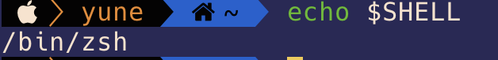
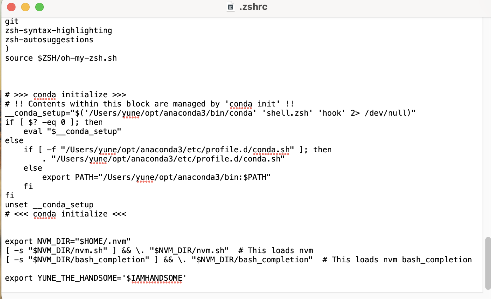
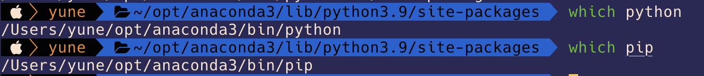

# First Install anaconda

- Go to [link](https://www.anaconda.com/#) To download Anaconda.
- go through the installation steps.

# Check if the path to anaconda python has been written in the configuration file .

## First check which shell you are using with command

`$ echo $SHELL`



OR

`$ ps $$`


Configuration file contains the commands that run in the shell. There are two main shells that is used by mac. Bash and Zsh.

Apple use set the Zsh as the default for any new user account that is created in macOS Catalina or later in 2019. Every new Mac uses the Z shell (Zsh) by default

Some old version mac is using bash. Configuration mechanic for mash is pretty messy becase there are several configuration files for bash in each level. For example
`.bashrc` `.bash_profile` `etc/profile`. If you dont want to switch to zsh, you can dive [deep in bash](https://www.baeldung.com/linux/bashrc-vs-bash-profile-vs-profile)

### For folks using zsh shell

Your configuration is in .zshrc

```
$ open .zshrc
```

Use source command to update your environment variable configuration.

```
$ source .zshrc
```

### For folks using bash shell

Your configuration is in .zshrc

```
$ open .bash_profile
```

Use source command to update your environment variable configuration.

```
$ source .bash_profile
```



You can see the Your anaconda python execution path between `# >>> conda initialize >>>`

## Check which pip and python you are using.

In this part you need to make sure the [pip](https://www.w3schools.com/python/python_pip.asp) (PIP is a package manager for Python packages).

Execution path and python execution path should in the same directory. Python and pip is like husband and wife. Before you do `import` in your python file. You need to make sure that you have already use the correct one pip to install the modules you like to import.

```
$ which python
```

```
$ which pip
```



# Install make command for mac

`$ brew install make`

If you don't have brew on your mac go to [Link](https://brew.sh/)

Run `$ /bin/bash -c "$(curl -fsSL https://raw.githubusercontent.com/Homebrew/install/HEAD/install.sh)"`
